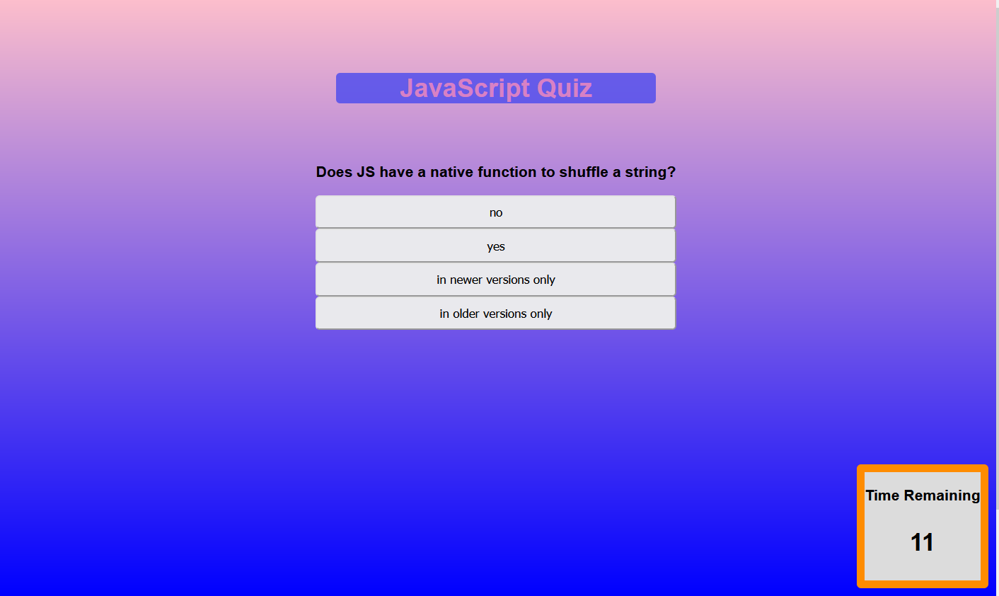
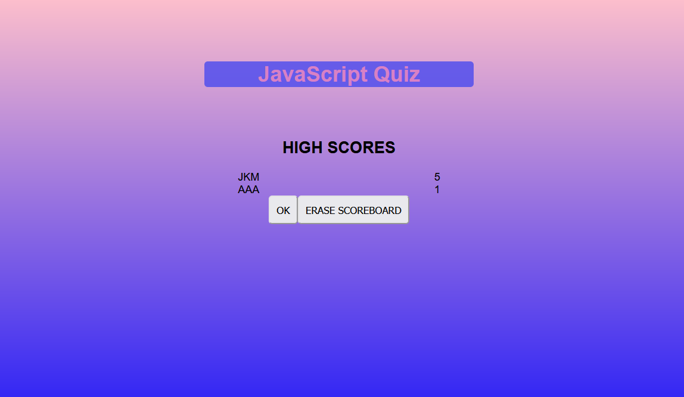
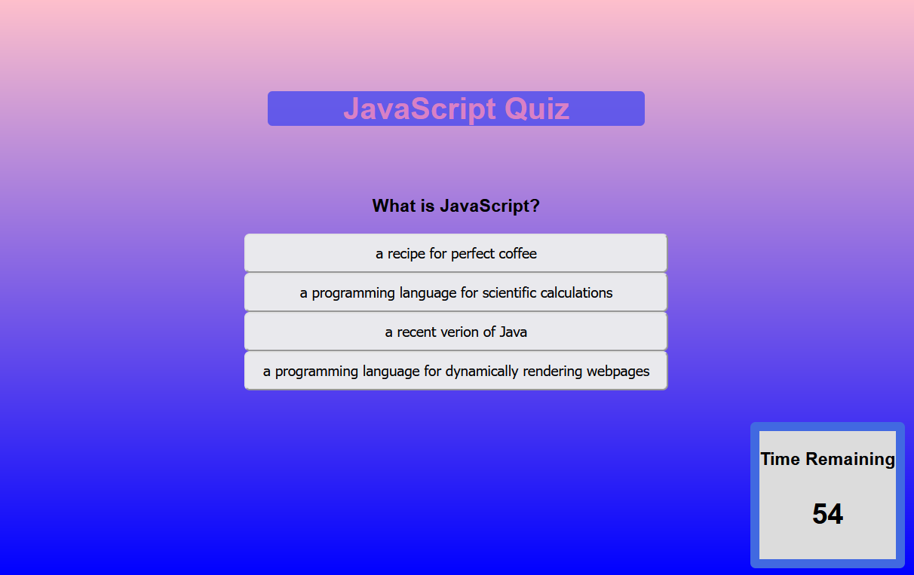

# codeQuiz

This program presents a basic JavaScript multiple choice quiz. 
There are five questions with four possible answers, and a one minute timer which drops 15 seconds every time an incorrect answer is selected. 
The border of the timer changes color every time we pass a ten second increment, progressing from blue to red. 
At the end of the quiz, the player has the option to enter their initials for the scoreboard, which is then displayed.  
  
   
 Please find the deployed program at the link below: 
<a href="https://nialvo.github.io/codeQuiz/">Code Quiz</a>
  
 For all inquiries, please email me via the link below: 
 <a href = "mailto: pilibili@protonmail.com">Send Email</a> 

